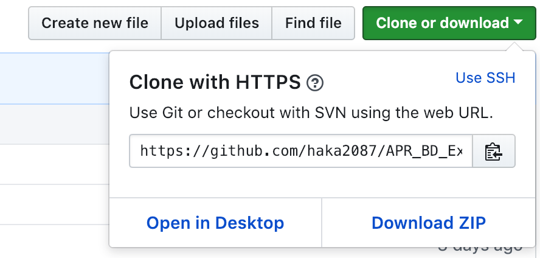

CONEXIÓN DE APP BD SQLite A SQL
==========================
Descripción : esta versión de la APP, se logro guardar datos en la Base de Datos SQLite de
la Aplicación y una vez guardado los datos, los podemos resivir en la BD exterana
SQL.

SOFTWARE UTILIZADO
==================
Para MacBook Pro (Retina, 13-inch, Late 2013)
-------------
- Android Studio   Versión 3.2.1
- El paquete de Software (XAMPP-OSX-7.2.12)

LINK DE DESCARGA
===================
- Android Studio [developer.android.com](https://developer.android.com/studio/?$

- [XAMPP] (https://www.apachefriends.org/es/index.html)
 
Para Ejecutar apps y emularla en Dispositivo
--------------------------------------------
- Deben descargar o clonar la APP, a su Pc.
- Descoprimir archivo descargado o en el terminal de tu PC, Utilizar el
comando git clone + Url que figura en el apartado CLONE or DONWLOAD.
  
- Iniciar Android Studio y abrir la APP descarda en la ruta, en la cual
la guardaron.
- Luego de haber cargado la APP en Android, conectar el dispositico Movil
en el cual iniciaran la APP.
- Presionar el Boton Run, en Android Studio, les aparecera su dispositivo
Móvil Conectado en el emulador de android con el Nombre del modelo de su
Telefono Móvil.
- Seleccionan su Móvil para la emulacion de la APP y presionan Aceptar.
- Su telefono pedira permiso para conectar al Pc.
- Aceptan esa opción y
luego de unos segundo se instalara la App su Móvil.
